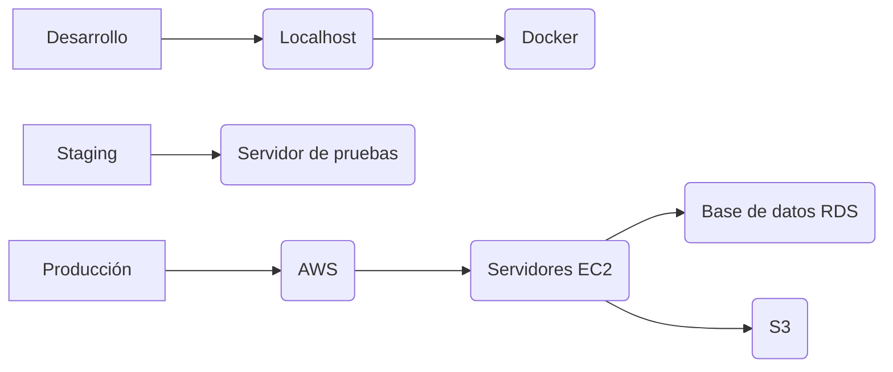
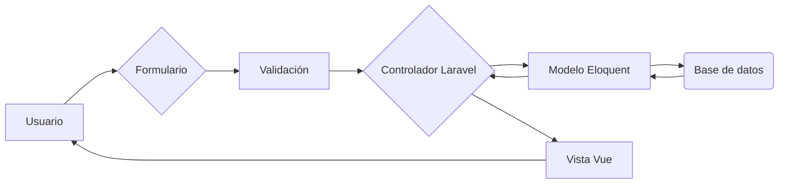

# Arquitectura del Proyecto

Tseyor.org es una plataforma web modular y escalable para la gestión de contenidos, equipos, boletines y recursos de la ONG Mundo Armónico Tseyor. El sistema está diseñado para facilitar la colaboración, la automatización y la evolución continua, integrando tecnologías modernas tanto en backend como en frontend.

---

## 1. Backend (Laravel)
- **Framework:** Laravel 10+ (PHP)
- **Principios:** Arquitectura orientada a servicios, uso intensivo de Eloquent ORM, separación de lógica en controladores, servicios y jobs.
- **Colas y jobs:** Uso de Redis y Laravel Queue Workers para tareas asíncronas (envío de emails, procesamiento de archivos, notificaciones, etc.).
- **Autenticación:** Jetstream (sin Sanctum), roles y permisos gestionados con Spatie Laravel Permission.
- **APIs:** Exposición de endpoints REST y uso de Inertia.js para comunicación directa con el frontend.
- **Módulos clave:**
  - Gestión de usuarios y permisos
  - Equipos y miembros
  - Boletines y suscripciones
  - Comunicados y publicaciones
  - Archivos y almacenamiento (local y S3)
  - Notificaciones y eventos
  - Buscador global (TNTSearch/Scout)

---

## 2. Frontend (Vue 3 + Inertia.js)
- **Framework:** Vue 3 (Composition API), con autoimportación de métodos y componentes.
- **Integración:** Inertia.js conecta el backend Laravel con el frontend sin necesidad de APIs REST tradicionales.
- **Estilos:** Tailwind CSS 4 y DaisyUI 5 para una UI moderna y accesible.
- **Componentización:** Uso intensivo de componentes reutilizables, stores centralizados y composición de vistas.
- **Routing:** Ziggy permite compartir rutas de Laravel en el frontend JS.
- **Edición de contenido:** Editor TipTap para rich text.
- **Gestión de estado:** Stores reactivos para usuario, imágenes, API, navegación, etc.

---

## 3. Automatización y DevOps
- **Scripts de despliegue:** Bash y CMD para automatizar tareas comunes (workers, SSR, backups, etc.).
- **Testing:** PHPUnit para backend, tests de integración y unitarios; tests de frontend en proceso de integración.
- **Entornos:** Soporte para desarrollo local, staging y producción. Uso de MailHog para pruebas de correo.
- **Documentación:** Archivos dedicados para arquitectura, despliegue, seguridad, contribución y planificación.

---

## 4. Seguridad
- **Principios:** Validación exhaustiva de datos, control de acceso granular, protección CSRF y XSS.
- **Middleware:** Personalizados para rate limiting, control de abuso de IP, y gestión de sesiones.
- **Auditoría:** Logging de eventos críticos y errores.

---

## 5. Organización y colaboración
- **Estructura de carpetas:**
  - `app/` – Lógica de backend (modelos, controladores, servicios, jobs, traits)
  - `resources/js/` – Frontend Vue (componentes, stores, vistas)
  - `routes/` – Definición de rutas web y API
  - `database/` – Migraciones, seeders, factories
  - `public/` – Archivos públicos y assets compilados
  - `config/` – Configuración de paquetes y servicios
  - `storage/` – Logs, archivos temporales, backups
- **Documentación:**
  - `planificacion.md`, `hoja_de_ruta.md`, `TODO.md` para planificación y seguimiento
  - `CHANGELOG.md` para registro de cambios
  - `CONTRIBUTING.md` para guías de colaboración

---

## 6. Extensibilidad y futuro
- Arquitectura preparada para nuevas integraciones (IA, multimedia, API externa, etc.)
- Modularidad para añadir nuevas secciones o funcionalidades sin afectar el núcleo
- Priorización de la accesibilidad y la experiencia de usuario

---

> Para detalles sobre tareas, hitos y mejoras, consulta también `TODO.md` y `hoja_de_ruta.md`.

---

## Diagramas y representaciones visuales

Para facilitar la comprensión de la arquitectura, se recomienda incluir diagramas y representaciones visuales. Estos pueden incluir:

- Diagramas de componentes: Muestran los diferentes componentes del sistema y cómo interactúan entre sí.
- Diagramas de despliegue: Muestran cómo se despliega el sistema en los diferentes entornos.
A continuación, se proponen algunos diagramas que podrían incluirse:

### Diagrama de componentes

Este diagrama muestra los principales componentes del sistema y cómo interactúan entre sí.

```mermaid
graph LR
    A[Usuario] --> B(Frontend Vue 3);
    B --> C{Inertia.js};
    C --> D(Backend Laravel);
    D --> E[Base de datos MySQL];
    D --> F[Redis (colas)];
    D --> G[S3 (archivos)];
```

### Diagrama de despliegue

Este diagrama muestra cómo se despliega el sistema en los diferentes entornos (desarrollo, staging, producción).



### Diagrama de flujo de datos

Este diagrama muestra cómo fluyen los datos a través del sistema.


- Diagramas de flujo de datos: Muestran cómo fluyen los datos a través del sistema.

### [Ver índice de documentación](./index.md)
