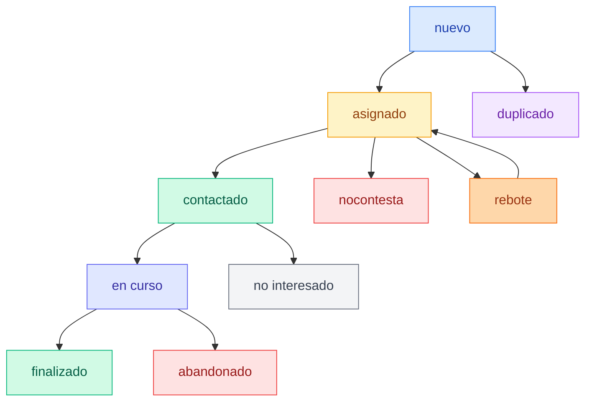

# Sistema de Gestión Automática de Inscripciones

## 📋 Tabla de Contenidos

1. [Introducción](#introducción)
2. [Características del Sistema](#características-del-sistema)
3. [Guía de Usuario](#guía-de-usuario)
4. [Documentación Técnica](#documentación-técnica)
5. [Estados y Flujo de Trabajo](#estados-y-flujo-de-trabajo)
6. [API y Endpoints](#api-y-endpoints)
7. [Configuración](#configuración)

---

## Introducción

El **Sistema de Gestión Automática de Inscripciones** automatiza el proceso manual de asignación y seguimiento de inscripciones a cursos de Tseyor. El sistema permite:

- ✅ Asignación automática de inscripciones a tutores
- ✅ Seguimiento del progreso de cada inscripción
- ✅ Notificaciones automáticas por email
- ✅ Interface de gestión para tutores
- ✅ Sistema de notas y comentarios
- ✅ Exportación de datos a CSV
- ✅ Sistema de rebote para reasignaciones

---

## Características del Sistema

### 🔧 Para Administradores

**Panel de Administración Backpack** (`/admin/inscripcion`)
- Interface completa de gestión administrativa
- Estadísticas en tiempo real integradas
- Filtros avanzados (estado, tutor, fechas)
- Asignación masiva desde el panel admin
- Botones de acceso directo al sistema completo
- Widgets informativos de seguimiento

**Funcionalidades:**
- 📊 4 tarjetas de estadísticas principales
- 🔍 Filtros avanzados (estado, tutor, rango de fechas)
- 📤 Exportación CSV personalizada
- ⚡ Asignación masiva con selección múltiple
- 🔄 Reasignación de inscripciones
- 🎛️ Panel administrativo completo con Backpack

### 👥 Para Tutores

**Mis Asignaciones** (`/inscripciones/mis-asignaciones`)
- Lista de inscripciones asignadas con vista de tarjetas intuitiva
- **Modal de gestión de notas** con editor TipTap integrado
- **Modal de rebote** con validación de motivo mínimo (10 caracteres)
- **Selector de estado** en línea para cambios rápidos
- Alertas de seguimiento urgente con indicadores visuales
- Información completa de contacto por tarjeta
- Indicadores de tiempo desde asignación y última notificación

**Funcionalidades Nuevas en Mis Asignaciones:**
- 📝 **Editor de notas modal**: Interface completa con TipTap para notas de seguimiento
- 🔄 **Cambio de estado directo**: Dropdown integrado en cada tarjeta
- ↩️ **Sistema de rebote mejorado**: Modal con validación de motivo y contador de caracteres
- 🏷️ **Etiquetas de estado visual**: Badges de color dinámico por estado
- ⏰ **Indicadores de urgencia**: Alertas visuales para inscripciones que requieren atención
- 📱 **Interface responsive**: Adaptado para mobile y desktop

**Gestión Individual** (`/inscripciones/gestion/{id}`) - *Legacy mantenido*
- Vista completa de la inscripción
- Datos de contacto con enlaces directos (email, teléfono)
- Acciones rápidas para cambio de estado
- Sistema de notas con timestamps automáticos
- Opción de rebote con justificación

---

## Guía de Usuario

### 🔐 Acceso al Sistema

El sistema utiliza los roles y permisos existentes de Laravel:
- **Administradores**: Acceso completo al CRUD y gestión
- **Tutores**: Acceso a sus asignaciones y gestión individual

### 📱 Uso del Dashboard (Administradores)

**Acceder al Panel Admin (Backpack)**
   ```
   /admin/inscripcion
   ```

### 👨‍🏫 Uso de Mis Asignaciones (Tutores)

**Acceder a Mis Asignaciones**
   ```
   Menú de usuario → Mis Asignaciones
   ```
   *Nota: El enlace solo aparece si tienes inscripciones asignadas*


### 🚨 Alertas y Notificaciones

**Alertas de Urgencia:**
- Se muestran para inscripciones sin contacto > 7 días
- Aparecen en rojo en la parte superior de la gestión
- Incluyen el número de días sin contacto

**Notificaciones por Email:**
- Se envían automáticamente al asignar inscripciones
- Incluyen datos de contacto y enlace directo a gestión
- Sistema configurable en `config/inscripciones.php`

---

## Documentación Técnica

### 🏗️ Arquitectura del Sistema

**Patrón MVC:**
- **Modelo**: `app/Models/Inscripcion.php` - Lógica de datos y relaciones
- **Controlador**: `app/Http/Controllers/InscripcionesController.php` - Lógica de negocio
- **Vistas**: Vue.js components con Inertia.js

**Componentes Frontend:**
- `Gestion.vue` - Gestión individual de inscripciones
- `MisAsignaciones.vue` - Lista de asignaciones por tutor

**Panel Administrativo Backpack:**
- `InscripcionCrudController.php` - Controlador CRUD completo
- Widgets personalizados para estadísticas y acciones masivas
- Botones de integración con sistema principal
- Filtros avanzados y visualización optimizada

### 🔧 Dependencias Técnicas

**Backend:**
- Laravel 11
- Inertia.js para SPA
- MySQL para base de datos
- Laravel Mail para notificaciones

**Frontend:**
- Vue.js 3 con Composition API
- Tailwind CSS para estilos
- Componentes auto-importados

### 📊 Base de Datos

**Tabla Principal**: `inscripciones`

**Campos Añadidos por la Migración:**
```sql
user_id              BIGINT UNSIGNED NULL      -- FK a users table
fecha_asignacion     TIMESTAMP NULL            -- Fecha de asignación
ultima_notificacion  TIMESTAMP NULL            -- Última notificación enviada
notas               TEXT NULL                  -- Notas y seguimiento
```

**Relaciones:**
- `belongsTo(User::class, 'user_id')` - Usuario asignado
- `hasMany` histórico de cambios (futuro)

**Índices:**
- `user_id` - Para consultas por tutor
- `estado` - Para filtros por estado
- `fecha_asignacion` - Para ordenación temporal

### 🛣️ Rutas del Sistema

/inscripciones/mis-asignaciones -> ....

---

## Estados y Flujo de Trabajo

### 📋 Estados Disponibles

| Estado | Descripción | Color | Flujo |
|--------|-------------|-------|--------|
| `nueva` | Recién creada, sin asignar | 🔵 Azul | → `asignada` |
| `asignada` | Asignada a tutor, sin contactar | � Amarillo | → `contactado` |
| `contactado` | Tutor ha hecho contacto inicial | 🟢 Verde | → `encurso/nointeresado` |
| `encurso` | Alumno tomando el Curso Holístico| 🔵 Índigo | → `finalizado/abandonado` |
| `finalizado` | Ha completado el curso | � Verde | Final |
| `abandonado` | Ha abandonado el curso | � Rojo | Final |
| `nocontesta` | No hay respuesta del inscrito | 🔴 Rojo | → `rebotada` |
| `rebotada` | Devuelta para reasignación | 🟠 Naranja | → `asignada` |
| `duplicada` | Inscripción duplicada | 🟣 Púrpura | Final |
| `nointeresado` | Inscrito no interesado | ⚫ Gris | Final |

### 🔄 Flujo de Trabajo Típico



**Rutas Principales:**
- **Flujo exitoso**: `nueva` → `asignada` → `contactado` → `encurso` → `finalizado`
- **Abandono natural**: `encurso` → `abandonado`
- **Sin respuesta**: `asignada`/`contactado` → `nocontesta` → `nointeresado`
- **Reasignación**: `asignada` → `rebote` → `asignada`
- **Duplicado directo**: `nueva` → `duplicada`

### ⚡ Nuevas Funcionalidades de Gestión

La vista "Mis Asignaciones" permite gestionar las inscripciones de para el  Curso Holístico de Tseyor.

**Esta vista permite para cada persona inscrita:**

- Cambiar el **estado de la inscripción**.
- Ver y **editar notas** para su seguimiento.
- Si no puedes atender la inscripción, la puedes **rebotar** indicando el motivo.

---

## API/Endpoints

### 📡 Endpoints Principales

Todos requieren tener sesión iniciada para funcionar.

**GET `/inscripciones/dashboard`**
- Retorna vista del dashboard solo para el administrador
- Acepta parámetros de filtro: `estado`, `tutor_id`, `fecha_desde`, `fecha_hasta`
- Respuesta: Vista Inertia con datos paginados

**GET `/inscripciones/mis-asignaciones`**
- Lista inscripciones del usuario autenticado
- Incluye alertas de urgencia automáticas
- Respuesta: Vista Inertia con inscripciones paginadas

**POST `/inscripciones/asignar-masiva`**
```json
{
  "inscripcion_ids": [1, 2, 3],
  "user_id": 5
}
```

**POST `/inscripciones/actualizar-estado/{id}`**
```json
{
  "estado": "contactado"
}
```

**PUT `/inscripciones/actualizar-notas/{id}`**
```json
{
  "notas": "Notas de seguimiento en formato markdown"
}
```

**DELETE `/inscripciones/rebotar/{id}`**
```json
{
  "data": {
    "motivo": "Razón del rebote (mínimo 10 caracteres, máximo 500)"
  }
}
```

### 📊 Respuestas de API

**Estructura Estándar:**
```json
{
  "success": true,
  "message": "Operación completada exitosamente",
  "data": {
    // Datos específicos del endpoint
  }
}
```

**Respuesta de Error:**
```json
{
  "success": false,
  "message": "Descripción del error",
  "errors": {
    "campo": ["Error específico del campo"]
  }
}
```

---

## Configuración

### ⚙️ Archivo de Configuración

**`config/inscripciones.php`**
```php
<?php

return [
    'estados' => [
        'nueva' => 'Nueva',
        'asignada' => 'Asignada',
        'rebotada' => 'Rebotada',
        'contactado' => 'Contactado',
        'encurso' => 'encurso Holístico',
        'abandonado' => 'Ha abandonado',
        'nocontesta' => 'nocontesta',
        'duplicada' => 'Duplicada',
        'finalizado' => 'Finalizado el Curso Holístico',
        'nointeresado' => 'No Interesado'
    ],

    'estados_no_elegibles' => ['rebotada'],

    'notificaciones' => [
        'primer_seguimiento' => 3,
        'intervalo_seguimiento' => 7,
        'estados_seguimiento' => ['asignado', 'contactado', 'encurso'],
        'estados_finales' => ['finalizado', 'duplicado', 'nointeresado', 'rebotada', 'abandonado']
    ],
    
    'dashboard' => [
        'items_per_page' => 15,
        'exportar_limite' => 1000,
    ],
];
```

---

### 🔧 Comandos de Diagnóstico

**Verificar Estado del Sistema:**
```bash
# Comprobar rutas
php artisan route:list --name=inscripciones

# Verificar migraciones
php artisan migrate:status

# Limpiar cachés
php artisan optimize:clear

# Verificar configuración de inscripciones
php artisan tinker --execute="config('inscripciones.estados')"

# Verificar inscripciones con estados null
php artisan tinker --execute="DB::table('inscripciones')->whereNull('estado')->count()"
```

---

## Integración con Backpack Admin

El sistema de inscripciones está completamente integrado con Backpack para Laravel, proporcionando una interface administrativa robusta y completa.

### 🎛️ Características del Panel Admin

**Acceso:** `/admin/inscripcion`

**Funcionalidades Principales:**

1. **Dashboard Integrado con Estadísticas**
   - 4 tarjetas de métricas en tiempo real
   - Nuevas, Asignadas, En Proceso, Finalizadas
   - Colores distintivos por estado

2. **Listado Avanzado**
   - Filtros básicos por estado, tutor asignado y búsqueda de texto
   - Columnas optimizadas con información clave
   - Badges de colores para estados
   - Indicadores de urgencia para seguimiento
   - Compatible con versión gratuita de Backpack

3. **Acciones Masivas**
   - Widget personalizado para asignación masiva
   - Selección de múltiples inscripciones
   - Asignación a tutor con confirmación
   - Feedback visual del proceso

4. **Vista Detallada (Show)**
   - Widget de información de seguimiento
   - Datos completos del inscrito
   - Estado actual y historial
   - Botón directo al sistema de gestión completo
   - Acciones rápidas integradas

5. **Edición Completa**
   - Formularios estructurados por secciones
   - Validaciones automáticas
   - Campos legacy mantenidos por compatibilidad
   - Relaciones con usuarios automáticas

### 🔧 Componentes Técnicos

**Controlador Principal:**
```php
App\Http\Controllers\Admin\InscripcionCrudController
```

**Rutas Adicionales:**
```php
POST /admin/inscripcion/asignar-masiva
POST /admin/inscripcion/{id}/cambiar-estado
```

**Widgets Personalizados:**
- `inscripciones_acciones_masivas.blade.php` - Asignación masiva (compatible con versión gratuita)
- `inscripcion_seguimiento.blade.php` - Información de seguimiento
- `inscripciones_filtros_basicos.blade.php` - Filtros básicos sin dependencias PRO

**Botones Personalizados:**
- `gestionar_inscripcion.blade.php` - Enlace al sistema completo
- `dashboard_inscripciones.blade.php` - Acceso al dashboard

### 📊 Filtros y Búsqueda

**Filtros Disponibles:**
- **Estado**: Dropdown con todos los estados configurados (filtro básico)
- **Tutor Asignado**: Select básico con tutores disponibles
- **Búsqueda de Texto**: Campo libre para buscar por nombre o email
- **Compatibilidad**: Funciona con versión gratuita de Backpack

**Funcionalidades de Búsqueda:**
- Búsqueda global en campos principales
- Ordenación por columnas clave
- Paginación configurable (25 items por defecto)

### ⚠️ Nota de Compatibilidad

El sistema está optimizado para funcionar con **Backpack versión gratuita**. No requiere Backpack PRO para ninguna de sus funcionalidades principales:

- ✅ Filtros básicos implementados con widgets personalizados
- ✅ Acciones masivas compatibles con checkboxes estándar
- ✅ Widgets informativos sin dependencias PRO
- ✅ Todas las funciones administrativas disponibles

### 🔐 Permisos y Seguridad
**Restricciones:**
- Edición permitida para administradores
- Eliminación controlada
- Acceso basado en roles de Laravel

**Integración con Autenticación:**
- Usa middleware admin de Backpack
- Respeta permisos existentes del sistema
- Sesiones integradas con el sistema principal

### 🔄 Sincronización con Sistema Principal

**Doble Acceso:**
- Panel admin para gestión rápida
- Sistema completo para seguimiento detallado
- Datos sincronizados en tiempo real
- Botones de navegación integrados

**Compatibilidad:**
- Campos legacy mantenidos
- Transiciones de estado respetadas
- Notificaciones automáticas funcionando
- Exportaciones disponibles desde ambos sistemas

---

## 📝 Changelog y Versiones

**v1.0.0 - Julio 2025**
- ✅ Sistema base de asignación automática
- ✅ Dashboard administrativo con estadísticas
- ✅ Interface de gestión para tutores
- ✅ Sistema de notas y seguimiento
- ✅ Exportación CSV con filtros
- ✅ Sistema de rebote y reasignación
- ✅ Notificaciones automáticas por email
- ✅ Migración de datos existentes
- ✅ Integración completa con Backpack Admin
- ✅ Widgets personalizados para panel administrativo
- ✅ Acciones masivas desde Backpack
- ✅ Filtros avanzados y visualización optimizada

**v1.1.0 - Julio 2025 (Actualización Reciente)**
- ✅ Interface "Mis Asignaciones" completamente rediseñada
- ✅ Modal de gestión de notas con editor TipTap
- ✅ Modal de rebote con validaciones mejoradas
- ✅ Selector de estado directo en tarjetas
- ✅ Sistema de estados actualizado y sincronizado
- ✅ Migración de enum de estados completada
- ✅ Mejoras de UX y feedback visual
- ✅ Compatibilidad con estados null resuelto
- ✅ Integración en menú de usuario dinámico
- ✅ Manejo robusto de errores en frontend

---

*Documento actualizado: 24 de julio de 2025*
*Sistema en producción con nuevas funcionalidades modales*
*Última actualización: Interface Mis Asignaciones rediseñada con modales y validaciones mejoradas*
